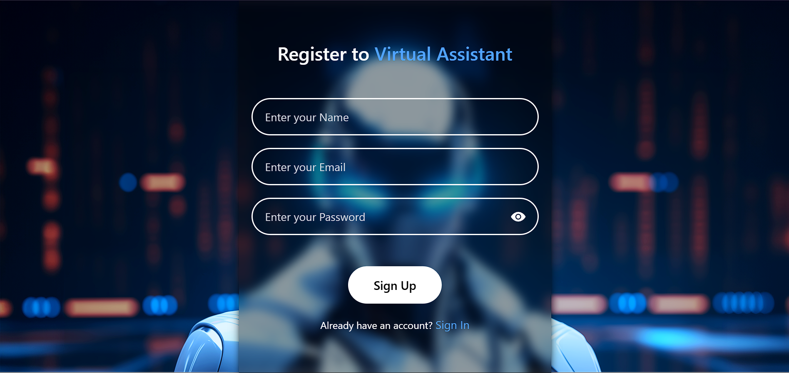
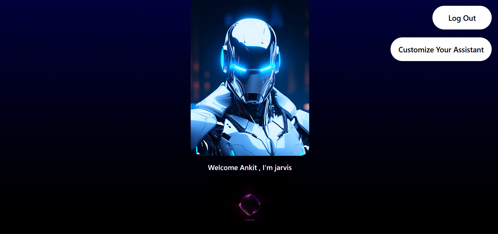
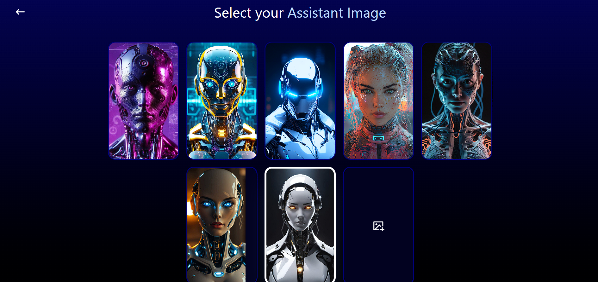
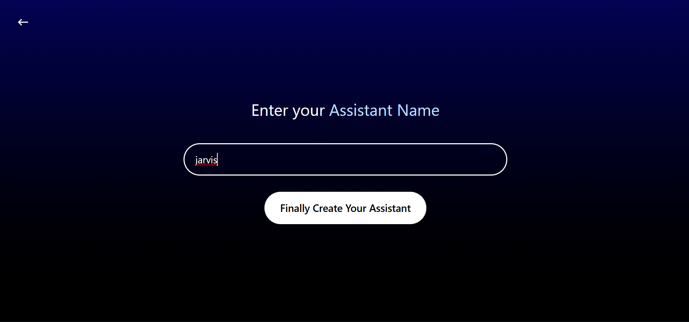
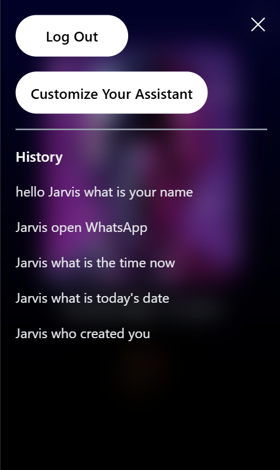

# AI Virtual Assistant (MERN Stack)

A full-stack AI virtual assistant where users can register, customize their assistant, and chat with it using real-time AI responses.

## Live Demo
https://virtual-assistant1-8yho.onrender.com

## Tech Stack
**Frontend:**
- React.js
- Tailwind CSS

**Backend:**
- Node.js
- Express.js

**Database:**
- MongoDB

**Other Tools & Services:**
- Multer (file uploads)
- Cloudinary (image storage)
- Gemini API (AI responses)

---

## Features
- User authentication (register & login)
- Assistant name and avatar customization
- AI-powered chat using Gemini API
- Image upload with Multer + Cloudinary
- Responsive UI for desktop and mobile
- Chat history accessible on small devices
- Full frontend–backend integration

---

## Screenshots

### Sign Up

### Home Screen

### Assistant Customization

### Assistant Name Setup

### Chat History (Mobile View)

